# Making a 🔥 Lit Discord Server

Making a lit Discord server is now easier than ever and for free. 

## Requirements 📝

* Discord account
* Verified Discord email account

## Steps

1. Have Discord open (the desktop version is preferred)

2. Add a new server by clicking on the add icon on the left side bar

   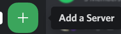

3. A popup will appear, on which you will need to select `Create My Own`

   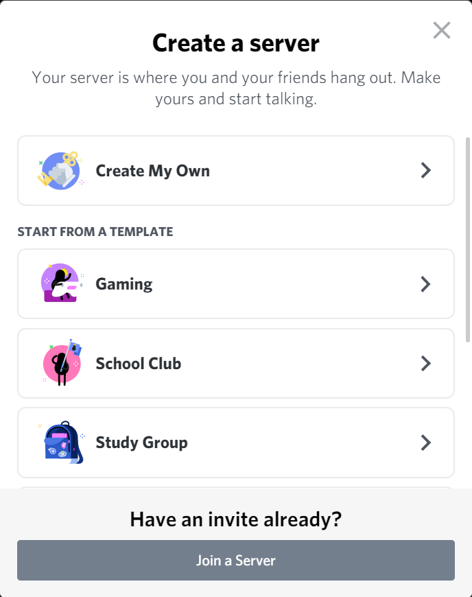

4. In the next slide it's fine to select any one of them, but I will **skip this question** for now

5. Think of a lit name and a lit logo (note for the server image logo, it can be a png with transparency or a gif if you have the server boost of level 1)

   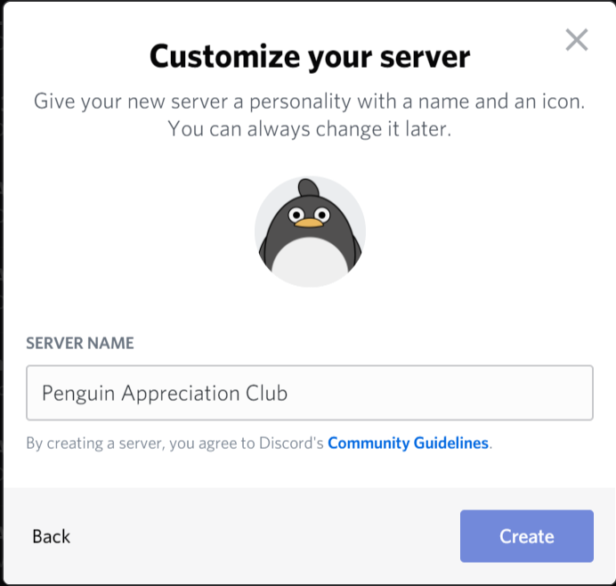

6. Now that your server is created, go to the **Settings** by right clicking on the server icon, Server Setting and clicking on **Overview** 

   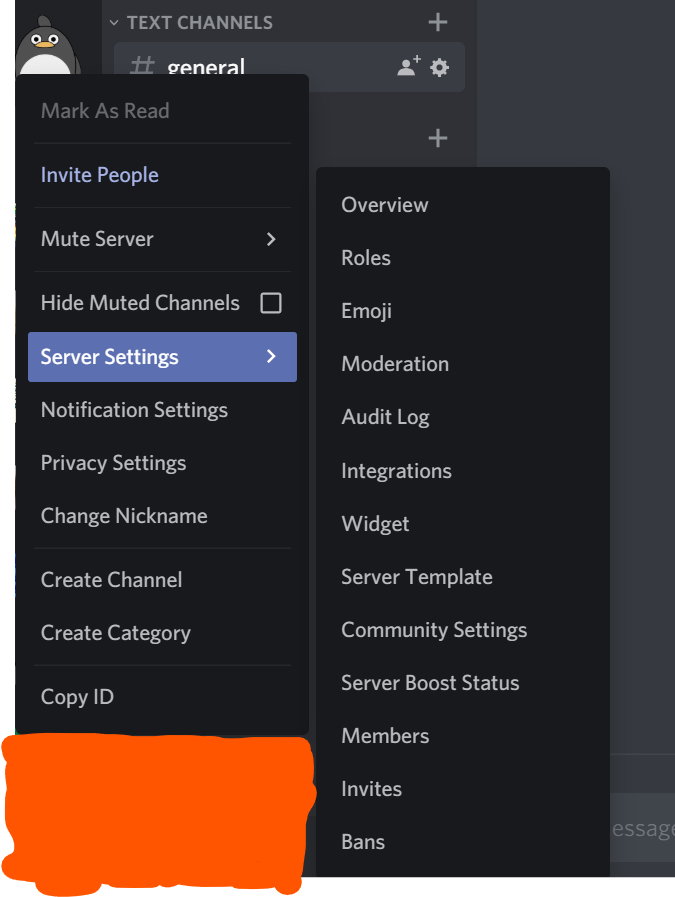

7. Another way to get to settings is by clicking the server name in the server itself and clicking **Server Settings** from there

8. In the overview, you can change the name, server logo image and if and where a message is issued when someone joins the server or boosts the server

9. Note upon every change, you must click **Save Changes** for the change to take effect, otherwise, clicking reset will not commit the changes

10. Next get some roles. Some good ones are **Mod**, **Verified**, and **Super User**. Of course, feel free to modify, change and experiment with these to get the right feel for your server

    * Some things to make sure of is to not assign anyone with the **Admin** permission 
    * Mods can have all boxes checked except **Admin** permissions
    * Verified can be done with a bot (will go into more detail in the bot section) and then view more channels
    * Super User can just allow embed links and files
    * For **everyone** else, you can change the permissioned such that they cannot send embed links or attach files if you are hesitant in handing power to the people

11. Emojis are a great way to spice your server. Remember non boosted servers have only 50 slots for emojis and can be extended to 250 with level 3 boost. In addition, you can add animated (gif) emojis but those can only be accessed by **Nitro** users. See below for boost perks

    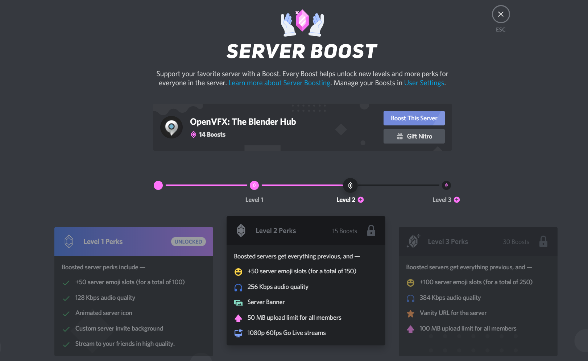

12. If you are setting up a bigger server with less trusted users, **Moderation** has some great settings for you.  You can make it such that every newly joined member must have a certain level of verification before messaging. In addition, there is media content filter if you feel unsafe with images and/or video

    * Note if you come in contact with trolls who are annoying and makes new accounts just to troll the server, the Discord recommendation is to do conflict resolutions (see https://discord.com/moderation/360060487093-443:-Ban-Evasion-and-Advanced-Harassment)

13. **Audit Log** shows a history of almost all the edits done to the settings 

14. Integrations are an advanced feature where you can use API calls to update the server with **Webhooks**. (The most common use of this is with GitHub hooks where it pushes a message on whatever you set with it [see [YouTube Video](https://youtu.be/-KDQqWNK3Tw) for more details on setting it up])

15. Server Widgets make it so you can display info (including members online and more) using an embed ifame. Using this, you can also set up a badge to feature the number of active users (see https://github.com/Naereen/badges#discord) where the format is ``). Note the server ID is found here but you **must** enable the server widget first (see image)

    

16. Server template allows you to save the current server as a template so you can clone it later and have similar roles, permissions, settings, and channels

    ### Community

17. This is where the most 🔥 lit part of Discord lives

18. Enable community, because otherwise, you have a plain Discord server instead of a ***lit*** server. To do this you must be a verified user (email verification on owner account). 

19. Follow the steps, noting it will create a rules and community updated channel and agree to the terms and condition after reading over the guidelines*

20. By default, Discord will create a **rules** channel and a **moderator-only** channel, in addition to sending a message in the moderator-only channel

21. Now with communities enables, we can add channels of a different type including

    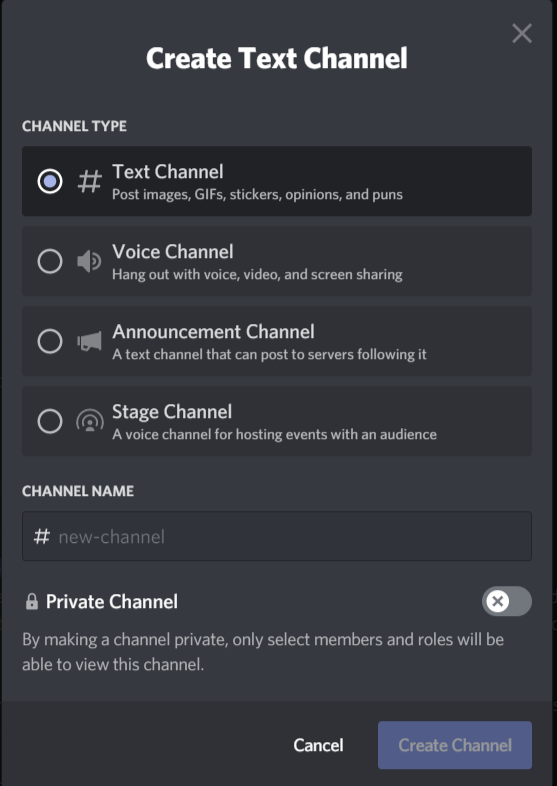

    * **Text Channel** - A general text channel to share your thoughts textually or your dank memes 
    * **Voice Channel** - a voice room to chat and share video or your screen with. * note there is a limitation on the number of people allowed to join and this number may be affected by the number of video participants
    * **Announcement Channel** - Make announcements and allows people to follow the channel so they get updated (with a ping) once something new gets posted
    * **Stage Channel** - Like a voice channel but more for staging events, ie one person talking and everyone else watching

22. Named the channel and decide if it should be public (everyone can see it) or private (only select people can see it)

23. Community also provide you some other goodies like viewing stats on the server and joining up for the partner program 

24. One of the best parts of community is making your own membership screen and welcome screen

25. The **Welcome Screen**, is just that. A screen to welcome new users/members. You must chose which channel to bring them to at the start (the rules page would be a great place to start). If you have boost, you can also add a background banner

    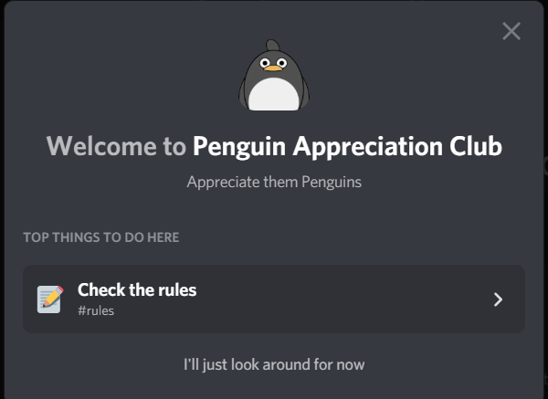

26. Make sure you enable the **Welcome Screen** such that the new users will actually see it (see above image)

27. The **Membership Screening** is another set of tools for welcoming new users. This one deals with providing the number with some rules and requirements for them to accept then they can join. (see below)

    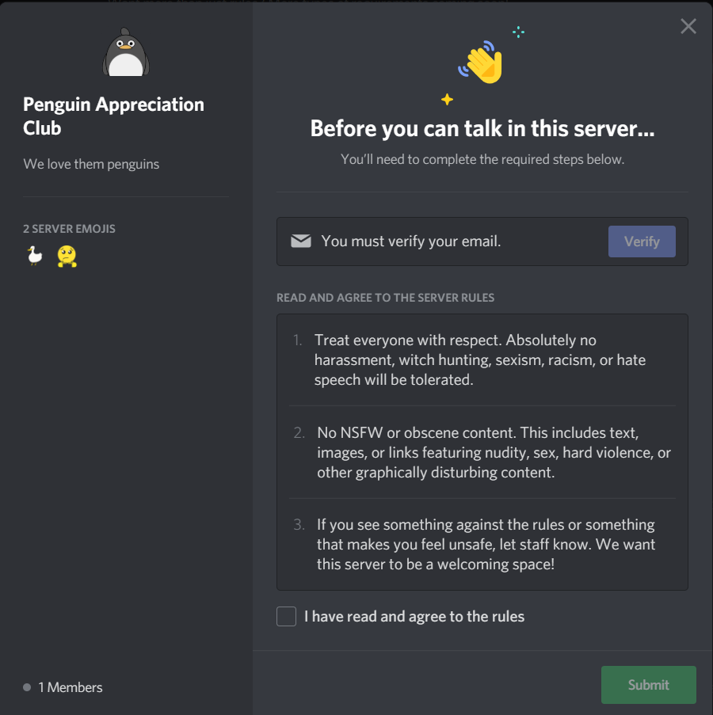

    ### Bots

28. Another important but lesser known aspects about Discord are the bots. These are programs the 3rd party users provide for server owners to use but be careful! Some bots are **malicious**! To browse through some common Discord bots see [top.gg](https://top.gg/)

29. Some common ones are MEE6 for moderation, TeX bot, for LaTeX support, and Groovy, for jamming out to songs on YouTube!

30. Note there are also bots for assigning roles and checking if the user check off on the rules, but since this would already be done the community part, it is optional in this case.

31. Have fun experimenting for different bots, but make sure you stay safe while browsing and testing

    ### Channels

32. Now the meat and potatoes of the Discord content can start

33. By right clicking on the channels sidebar, the options are **Create Channel**, **Create Category**, and **Invite People**

34. By creating a new channel, you can select options described on step 21. You can also create categories for you to group channels. 

35. If you want to change a channel to private, only those that are permitted to view can join (by default this is set to Moderator). The private channels are shown as a pound with a lock on the top right.

36. To move/organize the channels, simply drag the channel names to where you want it

37. If you do not want to receive notifications for certain channels or groups, right click on it then do **Mute Channel** and select how long you want to mute it for. This will block everything except pings to you. Another way to not receive notifications is to do **Notification Settings** and select the level are which Discord will ping you

38. Remember you can set permissions for channels and groups such as who is able to view, speak, place embed links, etc by going into the **Edit Channel** after right clicking the channel or group. This is the part where you can make it so pings @everyone or for a role can be disable (although this could be done with user permissions as well)

39. Within **Edit Channel**, you can also change the channel name, a general description (**Channel Topic**) that will show at the top of the channel when active, set it as NSFW (requiring the user to accept into continuing into the server), and setting a slowmode. 

40. Slowmode will restrict a user from sending a message over the interval set unless they have permission to do so

41. Deleting the channel or voice can be done in the **Edit Channel** as well

42. Lastly, remember lit servers use a lot emojis in the channel name

    ### User Management

43. In the user management section, the Mods can change the role of people, change the nickname, or ban/unban members 

44. Here you can also revoke invitation links in the **Invites** section. 

    ## FIN

45. The final step is to share the invitation links why clicking the person + button beside the channel or right click channels sidebar and select **Invite People**

    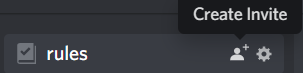

46. This will bring up a list of all your recent private messages and you can invite people individually, but the better idea is to create an invitation link by clicking **Edit invite link** (see below)

    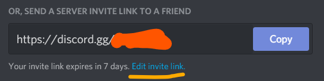

47. Now you can customize the invite link so it expires after a certain amount of time and/or a certain amount of uses. It's also possible to grant someone a temporary membership so they can are kicked when they disconnect (\* note it's possible to create a permanent link by setting it to Expire: Never, Max uses: No Limit)

    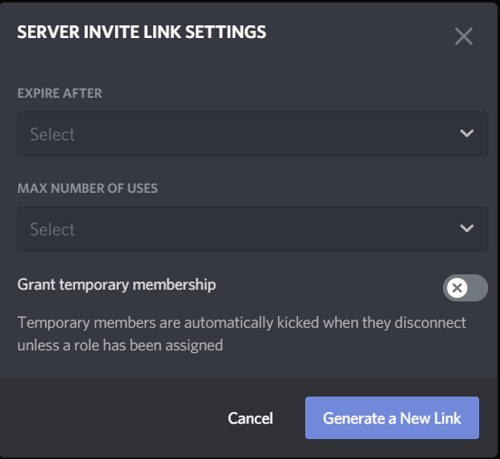

48. Now you have a 🔥 lit server! Don't forget to star and share this repo if you found it helpful

## License

 